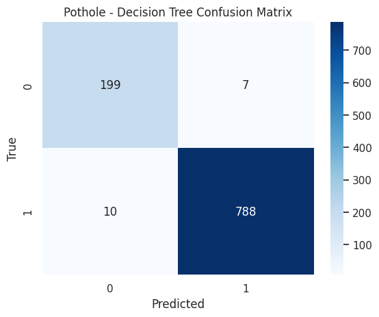
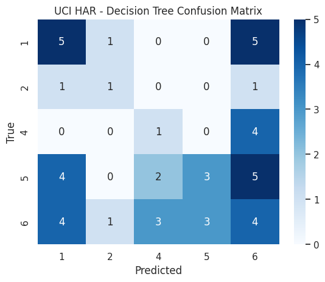
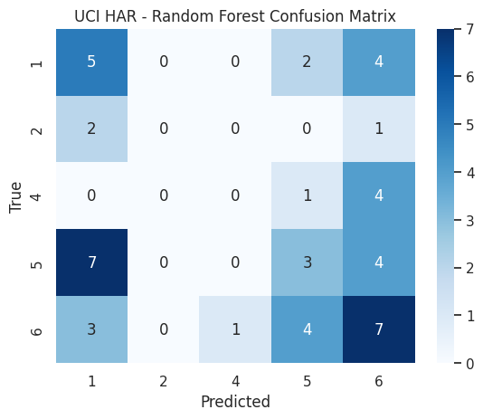
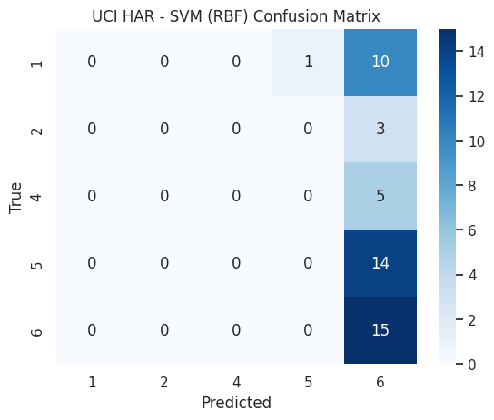

# Pothole Detection from Motion Sensor Data

## Contents

* [Overview](#overview)
* [Objectives](#objectives)
* [Methodology](#methodology)
* [Results](#results)
* [Project Structure](#project-structure)
* [Data](#data)
* [Installation](#installation)
* [Usage](#usage)
* [Technologies](#technologies)
* [Report](#report)
* [Author](#author)

---

## Overview

This project presents a machine learning approach to detecting potholes using motion sensor data collected from vehicles. The objective is to develop a scalable and cost-effective method for monitoring road conditions, supporting maintenance prioritisation and improving transportation safety.

---

## Objectives

* Process and analyse motion sensor data for road surface classification
* Distinguish potholes from other road features
* Develop and evaluate supervised machine learning models
* Assess feasibility for real-world deployment

---

## Methodology

The project follows a structured machine learning pipeline:

1. **Data Collection**
   Motion sensor data representing different road conditions is used as input.

2. **Preprocessing**
   Noise reduction and signal preparation techniques are applied.

3. **Feature Engineering**
   Statistical and signal-based features are extracted from the data.

4. **Model Development**
   Supervised learning models are trained, including:

   * Decision Tree
   * Random Forest
   * Support Vector Machine (RBF kernel)

5. **Evaluation**
   Performance is assessed using accuracy, precision, recall, and F1-score.

---

## Results

### Pothole Dataset

The models achieved strong performance on the pothole dataset, demonstrating the effectiveness of the pipeline.

| Model         | Test F1 | CV F1 (mean ± std) | Accuracy |
| ------------- | ------- | ------------------ | -------- |
| Random Forest | 0.992   | 0.986 ± 0.019      | ~1.00    |
| SVM (RBF)     | 0.980   | 0.979 ± 0.028      | 0.99     |
| Decision Tree | 0.974   | 0.979 ± 0.012      | 0.98     |

The Random Forest model achieved near-perfect classification performance, with consistently high precision and recall across classes.

---

### UCI HAR Dataset

To evaluate generalisability, the pipeline was applied to a more complex multi-class dataset.

| Model         | Test F1 | CV F1 (mean ± std) |
| ------------- | ------- | ------------------ |
| Decision Tree | 0.290   | 0.223 ± 0.067      |
| Random Forest | 0.201   | 0.258 ± 0.079      |
| SVM (RBF)     | 0.097   | 0.110 ± 0.021      |

Performance was significantly lower due to increased task complexity, highlighting limitations in generalisation beyond the pothole detection domain.

---

### Key Visualisations

The confusion matrices below illustrate the classification performance of each model, highlighting the strong performance on the pothole dataset and the increased difficulty of the multi-class HAR task.

#### Pothole Dataset

* **Decision Tree**
  

* **Random Forest**
  

* **SVM (RBF)**
  

---

#### UCI HAR Dataset

* **Decision Tree**
  

* **Random Forest**
  

* **SVM (RBF)**
  

---

### Summary

The results demonstrate that motion sensor data can be used effectively for pothole detection, with the Random Forest model achieving the best performance. Strong cross-validation scores indicate good generalisation within the pothole dataset, while results on the UCI HAR dataset suggest that further refinement is required for broader classification tasks.

---

## Project St
